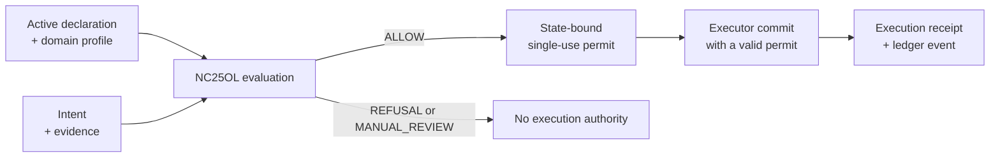

# NC25OL - Navigational Cybernetics 2.5 Open Ledger v0.0

**Explicit admission. Single-use permits. Recorded execution.**

[](https://github.com/petronushowcore-mx/NC25OL/actions/workflows/ci.yml)
[](#getting-started)
[](LICENSE)
[](LICENSE)

[Quickstart](#getting-started) · [Spectrum result](examples/spectrum_release/RESULT.md) · [Runbook](UNIVERSAL-CONNECTION-RUNBOOK.md) · [Specification](NC25OL%20Specification%20v0.0.docx) · [Scope and limits](#boundary-of-the-claim) · [Licences](LICENSE)

NC25OL provides a domain-neutral connection contract for placing an execution
boundary in front of an external adapter while preserving the declared NC2.5
separation rules. The package includes a Python reference engine, a wire
contract, domain profiles and executable local examples.



Only `ALLOW` provides execution authority. The permit binds the exact intent
and state; the executor revalidates it before commit. Contract and integrity
errors halt separately from the three admission dispositions.

The package is universal at the protocol layer, not at the admission layer. It
standardizes objects, roles, hashes, state transitions, refusal behavior,
reservations, permits, receipts and the audit chain. Every domain must provide
an explicit profile declaring its action alphabet, effect classes, resources,
controls, evidence obligations and mapping witness.

| Reference profile | Included example |
|---|---|
| [Banking](profiles/banking/bank-profile.json) | A complete banking profile with declared actions, controls and resource limits. |
| [Document release](profiles/document-release/reference-connection.json) | A non-banking profile and a complete evaluate-to-commit fixture. |
| [OTCS registry](profiles/otcs/reference-connection.json) | A registry profile with an [OTCS append-port bridge](sdk/python/nc25_otcs_bridge.py); admissibility remains in NC25OL. |

> [!NOTE]
> This is a reference and conformance package. The local examples use synthetic
> authority; production identity, key custody, trusted time and downstream
> transaction boundaries remain deployment responsibilities. Read the
> [scope and limits](#boundary-of-the-claim) before adapting it to a live system.

---

## Local document-release example

[The local example](examples/local_release/README.md) combines a synthetic OTCS
registration preview, an authenticated loopback document target and an exchange
of declaration conditions with a non-executable objection. It preserves separate
OTCS admission and Ledger authority, and includes refusal and recovery checks.
Its local credentials, fixed time and single-owner storage are explicit example
boundaries; no live witness or production service is connected.

## Local Spectrum observation example

[The Spectrum example](examples/spectrum_observation/README.md) collects pinned
XIV/XV finite-fixture observations and associates them with a Ledger registry
context. It preserves separate verdicts and unmeasured properties, checks source
and context changes, and refuses substituted or repeated reports within the live
session. It provides no execution authority or deployment conformance proof.

## Local Spectrum source release

[The source-release example](examples/spectrum_release/README.md) packages the
complete pinned Spectrum and XIV/XV source trees with a finite-fixture observation,
then releases the exact ZIP through the local document gateway. The
[recorded result](examples/spectrum_release/RESULT.md) includes exact source
versions and commands for reproducing the experiment. The example checks denial
before separate owner activation, exact target bytes and recovery without another
effect. Its authority and clock remain synthetic; no public upload is performed.

## Connection in one sentence

An authenticated connector submits an intent bound to an activated declaration
and domain profile; an independent evaluator returns either a short-lived,
single-use permit for that exact intent and state or a non-executable
disposition, and the executor may commit only through the valid permit.

## OTCS authority boundary

[OTCS](https://github.com/open-trust-commons/otcs-registry) is the separate
registry project created by Chris Perkins. The NC25OL profile, bridge and
reference examples in this package are contributions by Maksim Barziankou
(MxBv); OTCS retains its own authorship and governance.

The OTCS bridge is built inside this ledger. The active NC2.5 profile and
declaration define the admissibility atmosphere, and this evaluator alone
returns `ALLOW`, `REFUSAL`, or `MANUAL_REVIEW`. OTCS supplies typed facts —
entry-content rights, Registry Operating Grant, consent, mark permission,
opaque RFC 8785 hashes, and the expected project head — but it cannot issue or
override `ALLOW`; an `allowed` field in an OTCS receipt is rejected.

The boundary is:

1. OTCS facts and current head become an NC2.5 intent plus evidence bundle.
2. The bridge adds a digest of the complete append operation to the submitted
   evidence. The ledger evaluates that submission and, only for `ALLOW`, the
   bridge persists the append request and its original admission snapshot.
3. Before execution or recovery, the bridge verifies the operation, intent and
   original evidence against the authenticated submitted decision in the durable
   engine, then checks their agreement under the bridge's intent and evidence
   rules. Every transition snapshot is checked again. Before a downstream call,
   the row must also belong to the current profile and declaration, with a live
   NC2.5 permit. A dead permit in `PREPARED` becomes `NOT_EXECUTED`; OTCS is
   not called.
4. OTCS performs a project-scoped idempotent compare-and-swap append.
5. The exact OTCS receipt digest is sealed into the local execution event.
6. A stale head is recorded as failed execution with no debit. A downstream
   commit that can no longer be finalized locally enters reconciliation; it is
   never converted into a late authorization.

Recovery does not re-drive a row whose permit has stopped being live. This
covers both `CALLING` and `AMBIGUOUS`, because neither state proves the request
ever left the machine: `CALLING` says a call was about to happen, and
`AMBIGUOUS` says only that something other than a definitive OTCS rejection
went wrong — a refused connection or a failed handshake lands there with
nothing sent. Re-driving either after expiry could therefore be a first
downstream effect under a dead permit, which is the boundary this package
exists to hold. Such a row is refused with `OTCS_PERMIT_NOT_LIVE_ON_RECOVERY`
and left `RECONCILIATION_REQUIRED` — not `NOT_EXECUTED`, because "nothing
happened" is not a fact this bridge can establish for either state; only a
human, or an OTCS read by key, can settle it. Refusing costs nothing that was
available anyway: a row with a dead permit cannot be finalized locally either
way, so the downstream call before that refusal buys a wasted replay at best.
While the permit is still live, an ambiguous retry does re-issue the same
request, and project-scoped OTCS idempotency replays the original receipt so no
second external effect occurs. Reconciliation is never converted into a new
admission decision.

The admission snapshot stays local; OTCS receives only the existing four-field
append request. The reserved `NC25_OTCS_BRIDGE_OPERATION` evidence item records
which operation was submitted; it is not a rights grant. A resolver may still
resolve domain evidence according to the engine's policy. The check binds the
original submission to its decision, not the resolver's output to its input.

Rows created before this snapshot was introduced fail closed with
`OTCS_OUTBOX_ADMISSION`, including terminal rows. Reconcile them against the
original engine and downstream records before upgrading an active outbox; the
bridge never creates a replacement permit for a historical operation. This
binding trusts the durable engine and its authentication keys. It does not
provide a MAC over all outbox state or authenticate downstream receipts.

The local `authority_grant_id` remains the operational grant presented to the
NC2.5 engine. `OTCS_REGISTRY_OPERATING_GRANT` is a separate typed evidence
receipt. Conflating them would move the authority boundary and is invalid.

## Getting started

```text
pip install -r requirements-lock.txt
python -B tests/run_acceptance.py
```

The expected terminal result is `ACCEPTANCE_STEPS=8/8 PASS`, reported with
`PACKAGE_CHECKS=61/61` and `EXTERNAL_SOURCE_CHECKS=NOT_RUN`: the NC2.5 core is a
separate work and is not shipped here, so its five external-source checks do not
run. Those five checks compare a core file against the file name, SHA-256, byte
length, and line count recorded in `SOURCE-MANIFEST.json`; they do not read its
contents. The bound revision is not part of the public deposit under DOI
10.17605/OSF.IO/NHTC5, which carries an earlier revision of the core, so the
strict run is open to a holder of the bound file rather than to a reader of the
deposit. With that file in a directory named by `NC25_SOURCES_ROOT`, the run
reports `SOURCE_MODE=strict` and `PACKAGE_CHECKS=66/66`, which is the
configuration the shipped acceptance report records.

The failure-surface step publishes every figure under the name of the
procedure that produced it, re-derived from the sources and compared on every
run, never as a property of the engine in the abstract. What is mechanical is
the pairing of names: a figure without a procedure entry, or an entry without
a figure, fails the step. Whether a procedure's wording still describes the
code that computes it is maintained by hand and is not machine-checked.

The step keeps three closed-world vocabularies apart — engine refusal codes,
adapter wire codes, and the OTCS bridge's own refusal codes — and names, rather
than folds away, the codes the adapter's translation site re-emits that belong
to none of them — a code a test injected into
the engine and the adapter then carried onto the wire. Provenance there is the
constructing function, not set arithmetic, so a wire error merely built on the
adapter side is not counted as translated.

It reports two quantities side by side: every raise statement outside the
pinned validation helpers plus every pinned-helper call site, and the subset
whose emitted code is a single static literal. The gap is enumerated site by
site. These count raise sites rather than refusal sites — a few raise
`TypeError` and carry no contract code, and they are counted and named
precisely so that no raise goes unaccounted for.

Proof is recorded at runtime rather than parsed out of test source. A code
counts as witnessed only when a production-raised engine refusal reached test
code that checked exactly that code, by an equality reaching the code object
itself or by a regex matching this exception's rendering and no other code's;
a wire error's code never counts toward the engine's witnesses even where the
vocabularies overlap. Because no idiom list is consulted, a newly written test
in an observed form is covered the day it is written — but the observed forms
are bounded, and a check that converts the code first, as
`assertEqual(str(exc.code), CODE)` does, is not among them. Two further costs
are stated rather than implied: any passing equality in test code counts,
including bookkeeping that asserts nothing; and a regex admitting more than
one code of the closed world does not merely go uncredited, it fails this
step. Codes counted as constructed were built by engine or adapter code during
the run, which is not the same as having been raised.

The committed baseline pins the unwitnessed set as a no-growth debt ratchet,
and regenerating it cannot quietly give that up: a regeneration that loses a
witness, drops a code from the closed world, or grows the debt is refused
unless the reason is recorded in the baseline alongside what was given up. The
ratchet does not claim the remaining codes are complete, reachable, desirable,
or adequately tested.

Each surface declares its vocabulary where that surface's reader looks, and the
three places differ for a reason. The engine's codes are declared in the
contract its consumer reads: `Error.code` in the OpenAPI document, checked
against the live scan by a package check. That vocabulary is closed for what the
wire delivers, and the wire refuses a body nested past the limit, or carrying an
integer longer than the parser's digit limit, before it parses. Called
in-process, the engine trusts the shape of what it is handed: a list nested past
the limit in a resource claim, or an object whose own string conversion raises,
can leave it as a raw exception. The bridge has no wire contract — it raises
in-process to a Python caller that imported it — so it declares
`OTCS_REFUSAL_CODES` in the module itself, beside the code that raises them,
with `OTCS_INTERNAL_ONLY_CODES` naming the subset no public path reaches; and it
copies what it is handed at its door, refusing a document nested past the limit,
so the engine is called from it only with plain, bounded data. The
committed baseline holds all three worlds and is what the ratchet compares
against. A fourth copy would be a second writer with no reader.

The engine and the HTTP adapter import and run on the standard library alone.
The pinned dependencies are needed by the acceptance suite (`jsonschema`,
`PyYAML`), by the specification builder (`python-docx`), and by the optional
Ed25519 signers (`cryptography`), which fail closed when it is absent.

To read the whole package as a single hash-bound file rather than by navigating
the tree, build the review bundle:

```text
py -3 -B tools/build_review_bundle.py --output <path outside the package>
```

## Start here

1. Read `NC25OL Specification v0.0.docx`.
2. Read `UNIVERSAL-CONNECTION-RUNBOOK.md`.
3. Select or create a profile under `profiles/`.
4. Complete a declaration using
   `core/schemas/connection-declaration.schema.json`.
5. Validate every inbound object against its JSON Schema, then run the engine's semantic validation. The reference adapter does not run the schema step itself: it relies on the engine's own form checks, which refuse a malformed object before anything is recorded, and leaves schema validation upstream to the integrator.
6. Integrate against `protocol/universal-connection.openapi.yaml`.
7. Run `python -B tests/run_acceptance.py` before considering production substitution.

The shipped JSON examples are deterministic fixtures anchored to
`FixedClock(datetime(2026, 8, 1, 10, 0, 0, tzinfo=timezone.utc))`. Do not run
those fixtures with the default `SystemClock`: the example grant's window
closed on 2026-08-30, so a live-clock run activates the declaration and then
refuses to issue the grant at all, with `AUTHORITY_EXPIRED` (HTTP 400 over the
wire), before any intent is evaluated. Production declarations and grants must
instead carry live validity intervals resolved against trusted time.

## Package map

- `LICENSE` — CC BY 4.0 for the specification, MIT for the code and schemas.
- `SOURCE-MANIFEST.json` - byte-level anchor to the immutable NC2.5 core.
- `PACKAGE-MANIFEST.json` - exact SHA-256 and byte-length coverage of every shipped file except the manifest itself.
- `requirements-lock.txt` - pinned versions for schema, YAML, and DOCX
  tooling, plus `cryptography`, the optional runtime dependency of the
  Ed25519 signers (the default HMAC paths need only the standard library).
- `core/nc25-core-crosswalk.json` — exact NC2.5 passages used by the package.
- `core/schemas/` — profile, declaration, runtime, and registry contracts.
- `protocol/universal-connection.openapi.yaml` — role-separated wire contract.
- `sdk/python/nc25_universal_ledger.py` — standard-library reference engine
  (imports and runs without third-party packages; the optional Ed25519
  signers require the pinned `cryptography` wheel and fail closed with
  `ED25519_UNAVAILABLE` when it is absent).
- `sdk/python/nc25_universal_adapter.py` — standard-library reference WSGI HTTP adapter that enforces the wire contract (scope, activation seal binding, idempotency, permit path binding, error mapping) over the engine.
- `sdk/python/nc25_otcs_bridge.py` — permit-gated OTCS append bridge with a durable SQLite recovery outbox.
- `profiles/banking/` — the banking use case expressed as one profile.
- `profiles/document-release/` — a second executable reference profile.
- `profiles/otcs/` — the OTCS registry profile, typed operation, evidence, and receipt fixture.
- `examples/` — executable synthetic declaration, grant, intent, and evidence.
- `examples/local_release/` — local document release and declaration exchange,
  with component and integration checks and source mutations.
- `tests/test_otcs_bridge.py` — authority-boundary, idempotency, and crash-seam regressions.
- `tests/` — behavior, semantic contradiction, deliberate-break, contract
  conformance, contract regression, failure-surface ratchet, and package
  verification checks. The behavioral suite runs in full against all three
  shipped profiles, so portability is exercised by every test rather than claimed.
- `tools/` — deterministic builders for the specification document, its review
  projection, the package manifest, the acceptance report, and the review
  bundle, plus the failure-surface ratchet.
- `UNIVERSAL-CONNECTION-RUNBOOK.md` — onboarding and operational sequence.
- `ACCEPTANCE-REPORT.md` — local verification status and production boundary.

## Mandatory properties

- Only `ALLOW` is executable.
- `REFUSAL` and `MANUAL_REVIEW` are non-executable. The disposition alphabet
  is exactly these three values, and every one is producible by the reference
  engine; integrity failures and availability faults halt as transport-level
  errors, never as operator results.
- Missing, ambiguous, conflicting, expired, revoked, or unverifiable input
  fails closed.
- The evaluator computes a binary conjunction:
  `structural_gate AND effect_gate`.

`effect_gate` is the effect-conditioned domain-resource admissibility gate. It validates the declared effect's resource claim against the active domain profile; it does not execute or simulate the external effect.
- Gate geometry, margins, sub-verdicts, reason vectors, and retained statistics
  never enter operator selection.

The operator `message_code` is fixed by disposition:
`ALLOW` -> `EXECUTION_AUTHORIZED`, `REFUSAL` -> `EXECUTION_DENIED`, and
`MANUAL_REVIEW` -> `HUMAN_REVIEW_REQUIRED`. It never identifies the failed
gate or limit. The
disposition itself is an unavoidable one-bit decision channel; a production
adapter MUST rate-limit distinct probes per connector and alert on systematic
boundary-seeking sequences. The SDK exposes this closed set as the immutable
`PUBLIC_MESSAGE_CODES`; observer projection fails closed on any code outside it.
- The declaration names the origin of its structural capacity with the
  published four-value coding — `fully_stipulated`, `empirically_calibrated`,
  `derived_from_load_model`, or `mixed` (NC2.5 Probe II,
  DOI 10.17605/OSF.IO/7SQMY, R2). The value is sealed by the declaration hash
  and is never read by the gate.
- A material profile or declaration change produces a new version and hash.
- A permit is state-bound, reservation-bound, and debited at most once; its configured TTL cannot exceed 900 seconds, its expiry is capped by the authority grant and declaration, and the sealed `ttl_seconds` is that effective lifetime, so `issued_at + ttl_seconds` equals `expires_at` to the second. After a successful commit, an exact retry of the same execution request returns the stored receipt without another event or debit, including after permit, grant, or declaration expiry or revocation; a changed retry conflicts. This read-only replay cannot authorize new work. The reference engine restores its pre-call ledger, debit, permit, receipt, and replay state if an in-process exception interrupts commit.
- Revocation before commit invalidates outstanding permits for the grant.
- After binding, authority, action, declared action-target pairing, effect, target, and scope authorization,
  structurally valid negative evidence (INVALID, REVOKED, or EXPIRED)
  yields a recorded pre-gate refusal; malformed evidence remains a contract
  error with no business decision.
- Local evidence may be complete, but a shared registry stores hashes, status,
  revocation, and receipt roots only.
- Observer output is an out-of-band, non-mutating projection, uses the same
  disposition-bound public message codes as the operator surface, and is not
  an authority principal.

## Three records of different type

The package keeps three accumulators, and they are not interchangeable:

1. The hash-chained event ledger is an immutable append-only record of the
   declared event types, in order. Permit-state changes that append no event —
   a reservation expiry, a window-limit invalidation — are visible in permit
   state only, not in the chain. It is genealogy, not load.
2. The structural budget is a monotone committed-action counter read by the
   gate: capacity spent on one declared channel, never restored within a
   declaration.
3. The resource limits are sliding windows: committed amounts age out after
   `window_seconds`, so they are rate boundaries, not burden.

An immutable log is not by itself an account of structural load; it becomes
one only through a declared mapping from history into a burden quantity that
later decisions actually read (NC2.5 Probe II, DOI 10.17605/OSF.IO/7SQMY, H3).
Readers arriving from the NC2.5 corpus should not read `structural_budget` as
the core's structural burden: it is the committed-action channel only.

## Boundary of the claim

This is a reference and conformance package. It does not prove that an
arbitrary deployment belongs to an NC2.5 class, and it does not replace domain
policy, legal approval, identity infrastructure, a transactional system of
record, or independent deployment assurance.

The structural budget implements one accounting channel: committed actions. A
debit is recorded only when an execution commits; refusals, failed or aborted
commits, and standing load are not accounted, so the quantity is narrower than
the structural-pressure accounting defined by the NC2.5 core. A conformance
record over this channel does not determine how much continuation capacity
remains. The exact limits of counters and of conformance records are stated in
*A Counter Is Not a Burden* (DOI 10.17605/OSF.IO/TM7H6) and *A Certificate Is
Not a History* (DOI 10.17605/OSF.IO/YZF8S).

A new declaration version starts a new accounting instance with the full
declared capacity. `predecessor_declaration_hash` preserves lineage, but no
burden is carried across versions: the counter answers how much has been
committed since this declaration was activated. Any cross-version continuation
claim requires an external ledger and a separate argument.

The protocol mechanics are reusable only for domains that can be expressed by
the declared contract: a closed action alphabet, declared effect classes,
boolean control results, non-negative integer resource claims, typed evidence,
and the supplied role-separated runtime. If a domain cannot be represented
without weakening those constraints, create a new reviewed schema version; do
not force-fit it into this one.

The engine does not authenticate the calling principal. `actor_scope` is a
role, not an identity; the requesting subject is `intent.requester_id`, a value
inside the submitted bytes; and a permit is a single-use bearer capability that
any executor-scoped caller holding it may commit. The engine binds authority to
`requester_id` and to the permit, not to the transport. Two consequences follow
for a deployment that places more than one subject behind a single connector.
First, `requester_id` must be bound to the authenticated workload identity
(mTLS or equivalent) at ingress, so one subject cannot submit another's request:
the idempotency store returns a stored `ALLOW`, and its live permit, to any
caller that presents the same key and the same request identity - the intent
and the submitted evidence bundle, canonically hashed with the schema-declared
hash fields case-normalized, so a retry differing only in key order or hash
case replays and one with a different evidence bundle conflicts - and the
consumed-permit replay returns a stored receipt on executor role alone. Second,
permit handles must be protected as capabilities between co-tenant subjects.
Both are the responsibility of the production identity and transport layer,
which this reference engine does not provide.

For the same reason, the declaration's `connector.environment_ids` is
declarative metadata, not an enforced constraint. The engine has no runtime
environment input and never checks the environment a capability is exercised
in against that set; binding execution to a declared environment is part of
the transport context the production layer supplies. Declaring
`environment_ids` records intent; it does not by itself restrict the connector
to those environments.

The Python engine defaults to in-memory state.
Passing `state_path` enables a single-node SQLite store using WAL, FULL
synchronous commits, `BEGIN IMMEDIATE` serialization, and HMAC-bound snapshots.
Permit consumption, debit, receipt installation, replay state, reservations, and
the local event chain then survive process restart in one SQLite transaction.
Every public read takes the local state lock and reloads one verified SQLite
snapshot before returning, so long-lived instances do not serve cached state.
Its re-entrant process lock serializes state changes only inside one engine
instance. Its integrity guard deliberately verifies the full event chain on
every public operation, which preserves tamper detection but makes a long
append history unsuitable for a production hot path. Production requires
bank- or enterprise-managed identity, mTLS, asymmetric KMS/HSM signatures,
durable transactional idempotency, receipt replay, and reservations,
append-only or WORM retention with an indexed verification strategy, trusted
time, and atomic downstream commit.

The reference engine validates contract shape, identifier coverage, hashes,
and the declared `VALID` status. It does not authenticate the system behind an
evidence URI. Both untrusted-ingress surfaces have injectable authoritative
derivation: when `evidence_resolver` is supplied, connector status claims are
ignored, and when `control_resolver` is supplied, the derived prerequisite,
hard-block, manual-review, and ambiguity results replace the connector's
declared flags as gate inputs. A
canonical hash of the submitted intent and evidence bundle resolves exact
idempotency before authorization or external resolution. After binding,
authority, action-target, and scope checks pass, the resolver outputs are
validated, bound into the permit's own request hash, and used by the gate;
the operator result and the architect decision carry the submitted request
hash instead, so the hash a caller receives reveals nothing about the gate
stage. Resolver exceptions and malformed output fail closed on both
surfaces — a connector cannot fall back to its own claims by breaking a
resolver. Without the resolvers, `evaluate_intent` gates on the declared
intent flags and remains the explicit internal post-resolution boundary.
Production must wire both resolvers to approved authoritative systems inside
an independent evaluator. Resolver wiring is, like the permit-signer verifier
registry, process-local runtime configuration: it is not part of the persisted
snapshot, and every process sharing a `state_path` must be constructed with
the same resolver configuration. A stored `ALLOW` — whether replayed through
the idempotency store or committed through its outstanding permit — is
authoritative for the resolver state at issuance; its freshness window is
bounded by the permit's sealed effective lifetime and never exceeds 900 seconds.

The `signature` in the architect response is a versioned detached envelope
with `version`, `algorithm`, `key_id`, and `signature` fields, produced by a
pluggable permit signer. The reference default is `HmacDetachedSigner`
(HMAC-SHA256, hex signature); `Ed25519DetachedSigner` is a drop-in asymmetric
signer through the same protocol (base64 signature bytes), and its envelope
verifies independently from the published public key. Verification routes by
`key_id`: `rotate_permit_signer` makes a new key active while permits signed
under retired keys stay verifiable, and `revoke_permit_key` makes a revoked
key's permits refuse with `PERMIT_KEY_REVOKED`. Both custody operations are
governance-scoped: like every public operation they demand an explicit
`actor_scope`, and refuse without `nc25.governance`. An envelope naming a key the
engine never held, failing the cryptographic check, or carrying a wrong field
set fails closed as an integrity violation. Revocation is permanent and, with
a `state_path`, durable: the revoked key set is part of the persisted
snapshot, a revoked `key_id` can never be rotated back in, and restoring
state whose revoked set names the active signer fails loudly with
`STATE_REVOKED_ACTIVE_KEY` instead of silently resurrecting the key. The
verifier registry itself is, like the event signer, process-local runtime
configuration (keys are not persisted in SQLite): a restored process must
replay its `rotate_permit_signer` sequence before permits signed under
retired non-revoked keys verify again; until then they fail closed with
`PERMIT_KEY_UNKNOWN`. The append-only event chain carries the same envelope
shape by default (`HmacDetachedSigner` under key id `ledger-hmac`) and
through any custom `event_signer`, so independent chain verifiers see one
signature contract across permits and events. Production still requires
reviewed KMS/HSM custody with rotation and revocation evidence and
independent verification.
When reopening a `state_path` whose event chain contains Ed25519 envelopes, the
caller must provide an `event_signer` capable of verifying the persisted
algorithm and `key_id`; signer configuration and private keys are deliberately
not stored in SQLite. Omitting the verifier, or supplying one that declares
both an algorithm and a `key_id` and differs from the persisted envelope in
either, fails closed with `EVENT_SIGNER_REQUIRED`. The `EventSigner` protocol
requires only `sign` and `verify`, so a signer that does not declare both cannot be
compared against the envelope at all; for such a signer the mismatch is not
distinguished and reaches the caller as a chain verdict. A signer declaring the
same `key_id` with different key material likewise cannot be told apart from a
forged chain and so fails full-chain integrity verification.

The synthetic signing key in the fixtures is public test data, not a
credential.

## Contract validation and bounded failure policy

`failure_posture` is a required profile mirror of protocol-fixed outcomes:
`missing_required_data` is always `REFUSAL`, and `ambiguity` is always
`MANUAL_REVIEW`. Neither the profile nor the declaration can select an
alternative disposition.

Integrity failures remain raised hard errors because a compromised seal or
ledger cannot safely author a new disposition. This reference has no
downstream caller and no independent rule-conflict detector, so
`integrity_failure`, `downstream_unavailable`, and `rule_conflict` are not
decorative configuration fields. A production extension may add a reviewed
runtime branch and a new schema version when one of those conditions becomes
an executable contract surface.

The engine is a semantic validator, not a JSON Schema implementation. Every
profile, declaration, and runtime message must pass its matching schema in
`core/schemas/` at ingress before the engine is called. The schema gate enforces
string bounds and format keywords; the engine then checks identifier coverage,
hashes, ordering, state, and cross-object semantics. The shipped conformance
suite uses `Draft202012Validator` with `FormatChecker` and carries negative
probes proving that malformed `date-time` values and overlong strings are
rejected. If its optional libraries are absent, it reports `NOT_RUN`, never a
pass.

## Validate a profile

From the package root:

```text
python -B -c "import sys; sys.path.insert(0, 'sdk/python'); from nc25_universal_ledger import load_json, validate_profile; validate_profile(load_json(sys.argv[1])); print('PROFILE_VALID')" profiles/banking/bank-profile.json
```

`python -B tests/verify_package.py` always verifies the self-contained package.
When `NC25_SOURCES_ROOT` points to a directory holding the immutable NC2.5
core at the relative path declared in `SOURCE-MANIFEST.json`, it additionally
performs a strict byte-level check of that core. Without it, the verifier also
looks two directories above the package root for the core at the manifest's
relative path and, finding it there, runs the same checks in source mode
`auto`; with no core in either place the external check is reported as
`NOT_RUN`. It is never reported as passed unless a core was actually verified.

## Repository

- `.github/workflows/ci.yml` runs the acceptance suite and the review-bundle
  build, plus the local example checks and source mutations, on pushes and
  pull requests targeting `main`; the badge above reports
  its status. It runs the standalone configuration only: `NC25_SOURCES_ROOT` is
  not set there, so the external-source binding to the NC2.5 core reports
  `NOT_RUN` in CI and is exercised locally instead. The workflow file is
  itself manifest-bound, deliberately: how the package checks itself is part
  of what ships, so a fork that changes it rebuilds the manifest with one
  command rather than shipping an unbound file.
- `SECURITY.md` states what is in and out of scope and how to report a
  vulnerability privately.
- `CITATION.cff` provides citation metadata; GitHub renders a "Cite this
  repository" action from it.
- `CHANGELOG.md` records what changed in each version.
- `ADOPTERS.md` is an opt-in registry; the package collects nothing
  automatically and never phones home, so listing is a voluntary pull request.

These repository files are hash-bound in `PACKAGE-MANIFEST.json` and versioned
with the package like the other documents, but they carry no part of the
connection contract: a change to them is a repository change, not a contract
change.

## Authorship and licence

Maksim Barziankou (MxBv), The Urgrund Laboratheory.

Core anchor: Navigational Cybernetics 2.5 v3.0, identified by the file name and
SHA-256 recorded in `SOURCE-MANIFEST.json`. The core line carries DOI
10.17605/OSF.IO/NHTC5.

The specification and the documents listed under that heading in `LICENSE`
are licensed CC BY 4.0. The reference engine, schemas, protocol contract,
profiles, fixtures, tests and `examples/` directory are licensed MIT. See
`LICENSE` for the exact split and the attribution string. The
NC2.5 core is a separate work and is not distributed with this package.

## Source-root resolution

Package verification resolves the package root as `Path(__file__).resolve().parent.parent`. It does not search upward from the current working directory, so invocation location cannot redirect verification to a sibling tree.

## Temporal causality

The trusted engine clock is authoritative. `intent.received_at`, `evidence_bundle.collected_at`, and `authority_revocation.revoked_at` may not be more than five seconds ahead of trusted processing time. `execution_request.committed_at` may not be more than five seconds ahead of commit time or more than five seconds before the permit's trusted `issued_at`; accounting still uses trusted commit time.

Wire SHA-256 inputs use exactly 64 hexadecimal characters in either case; the engine normalizes comparisons and emits canonical uppercase values. On
`POST /v1/executor/permits/{permit_hash}:consume`, the path hash MUST equal the
body's `execution_request.permit_hash`. The reference adapter passes the path
value as `route_permit_hash` to `commit_execution`; mismatch fails with
`EXECUTION_PERMIT_MISMATCH` before permit lookup, replay, consumption, or debit.

## Resource-window boundary

Committed usage is measured over the closed interval `[now - window_seconds, now]`. A debit timestamped exactly at the lower boundary still counts; it ages out only after the boundary has passed.

## Registry revocation semantics

Registry `status` is the declaration lifecycle state. Registry `revoked` is a connector-level alert that at least one grant revocation exists; it is neither a connector shutdown bit nor an authorization source. Exact grant validity remains local and is rechecked during evaluation and commit.

Registry lookup is selector-bound. `registry_record` requires the exact connector ID from `GET /v1/registry/connectors/{connector_id}`. A different or unknown selector fails with `CONNECTOR_NOT_FOUND` and maps to HTTP 404; it never returns the active connector under the requested route.

## Reproducible release evidence

The canonical acceptance command is `python -B tests/run_acceptance.py`; `python` must resolve to a supported interpreter. Supported versions are Python 3.11 and 3.12 — the two the continuous-integration matrix runs; the dependency lock was generated on 3.12. The command blocks below use the equivalent Windows launcher form `py -3 -B`.

After any intentional package or specification change, rebuild the specification document first; its acceptance numbers and version are derived from the executable suites and `SOURCE-MANIFEST.json` at build time:

```text
py -3 -B tools/build_universal_specification.py
```

Then regenerate the review projection directly from the shipped DOCX:

```text
py -3 -B tools/build_docx_audit_projection.py
```

`DOCX-AUDIT-PROJECTION.md` binds the DOCX SHA-256 and exposes its visible text, ZIP member hashes, relationships, content types, and core metadata in readable text. `test_contract_regressions.py` fails if that projection is stale; `tests/verify_package.py` fails if the projected acceptance numbers or version drift from the executable suites and the declared package version.

If the change added, retired or newly witnessed a refusal code, regenerate the failure-surface baseline and the contract's `Error.code` enum, in that order; the baseline refuses to give up a witness or a code without an explicit reason, and the enum builder reads the same scan the package verifier holds the contract to:

```text
py -3 -B tools/build_package_manifest.py
py -3 -B tools/failure_surface.py --write-baseline
py -3 -B tools/build_error_code_enum.py
```

When suite membership changes, update the corresponding report counts from the declared suites before the first acceptance run. These edits and `--rebind-only` prepare a candidate; they do not certify it. The report is accepted only after the full run passes and the report is regenerated from its results.

Then rebuild the manifest and produce the machine evidence outside the package so it cannot silently enter the source manifest:

```text
py -3 -B tools/build_package_manifest.py
py -3 -B tools/build_acceptance_report.py --rebind-only
py -3 -B tools/build_package_manifest.py
py -3 -B tests/run_acceptance.py --json-output C:\tmp\nc25-acceptance.json
py -3 -B tools/build_acceptance_report.py --acceptance-json C:\tmp\nc25-acceptance.json --geometry-json C:\tmp\visual-geometry-report.json
py -3 -B tools/build_package_manifest.py
py -3 -B tests/run_acceptance.py
py -3 -B tools/build_review_bundle.py --output C:\tmp\REVIEW-BUNDLE.md
```

The preliminary rebind updates the report's byte references so acceptance can run after an edit; it does not replace that run. Rebuild the manifest after each report update because the report itself is included. The final acceptance run must pass over the final bytes before the freeze. `visual-geometry-report.json` is produced outside the package by a headless LibreOffice render of the DOCX to PDF and page rasters followed by an automated geometry audit; the render tooling is deliberately not part of the package. The audit hashes the copy of the DOCX that was rendered, kept next to the rasters, and records it as `source_docx_sha256`; and the report generator refuses geometry that names no document or a document other than the one the acceptance run bound.

The acceptance report takes its date, gate counts, page count, geometry status,
hard findings, and warning count only from those machine-readable inputs. The
review-bundle builder gathers the whole package into one hash-bound file, so it
can be read end to end without navigating the tree: it accepts only files bound
by `PACKAGE-MANIFEST.json`, adds the manifest itself to the bundle, rejects
stale hashes, and rejects output paths inside the package. Identical package
bytes produce identical bundle bytes and SHA-256.
